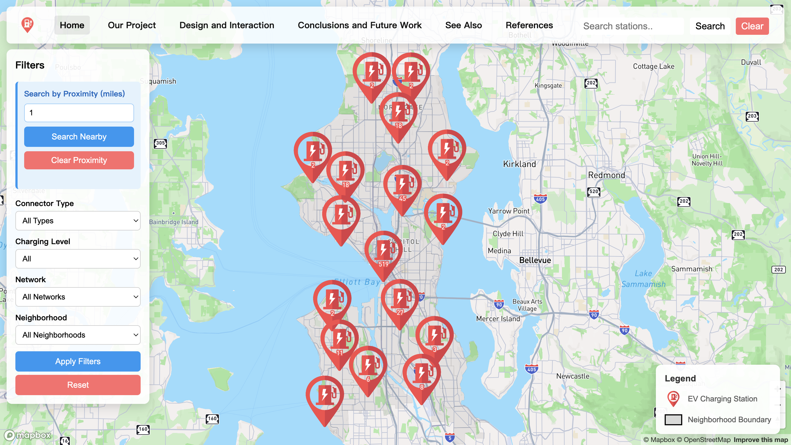
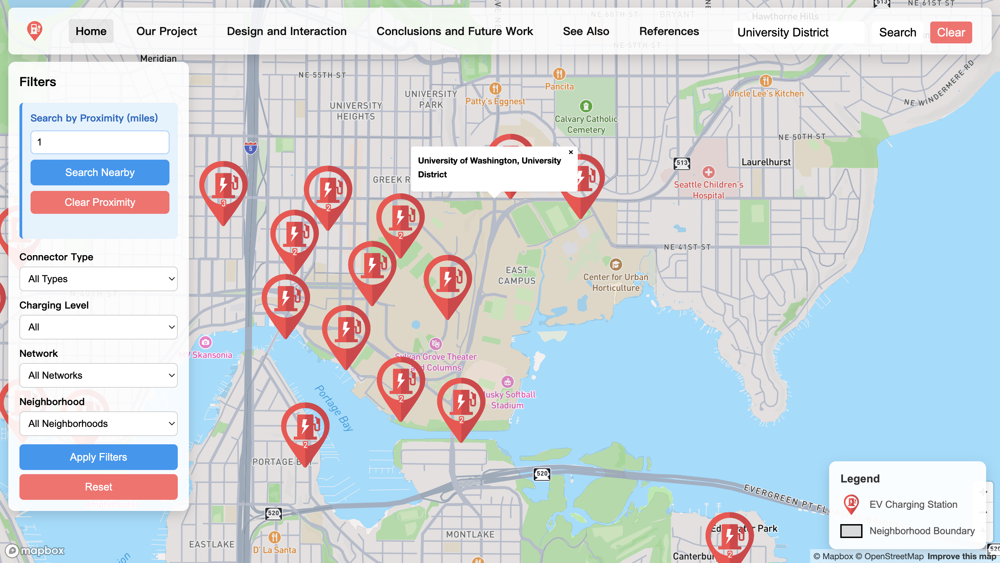
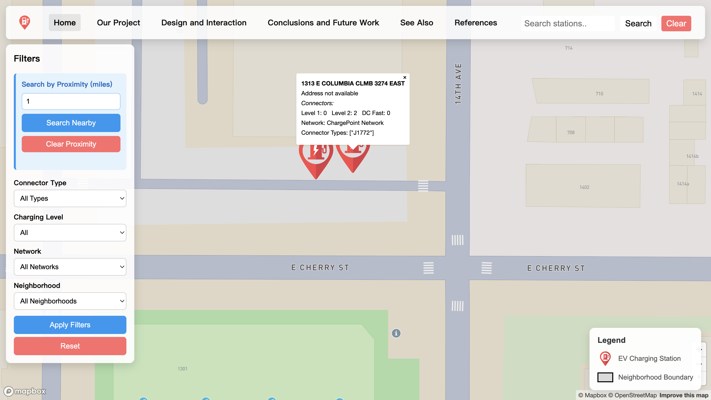

# Seattle EV Charging Stations Interactive Web Map

    
    

---

## Project Description  

The *Seattle EV Charging Stations Interactive Web Map* is a client-side, browser-based geographic information application designed to help users explore the availability, distribution, and characteristics of electric vehicle (EV) charging stations across Seattle. Built using Mapbox GL JS, HTML, CSS, and JavaScript, the map displays individual EV station locations with custom icons, supports interactive pop-ups, and includes user-friendly tools such as search, filters, proximity queries, and neighborhood-based exploration.

This web map provides a clean, intuitive user interface that allows individuals to examine both the large-scale spatial patterns of EV infrastructure and station-level details. Features like clustering, animated zoom transitions, custom icons, and detailed informational pop-ups enrich the experience and allow users to navigate through Seattle's EV resources effectively.

The map is fully hosted through GitHub Pages, ensuring public accessibility without requiring installation or special permissions. The project also emphasizes clean interface design, mobile responsiveness, and efficient browser performance, making it useful both for general audiences and technical users alike.

---

## Project Goal  

The goal of this project is to communicate the significance, accessibility, and distribution of EV charging infrastructure within the Seattle metropolitan area. As electric vehicle adoption continues to grow, understanding where charging stations are located becomes increasingly important for drivers, planners, and policymakers.

This project aims to:

1. **Support EV users** by helping them locate nearby charging stations quickly and visually.
2. **Increase public awareness** of Seattle’s current EV infrastructure.
3. **Assist planning and research** by showing spatial gaps or clusters in charging availability.
4. **Promote sustainability** by encouraging the use of renewable and low-emission transportation options.
5. **Provide an interactive educational tool** for anyone interested in clean energy transitions.

Through simplified visualization and thoughtful presentation, the map allows users to understand not only *where* EV stations are located but also *how* those locations relate to neighborhoods, commercial centers, major roads, and environmental equity considerations.

---

## Application URL  

The live, deployed version of the application can be accessed at:

👉 **https://lizbethsarabia.github.io/Seattle-EV-Stations-Web-Map/index.html**  

This is the publicly accessible version hosted on GitHub Pages.

---

## Favicon and Icon Overview  

The project uses **two different icons**, each serving a specific role in the interface. This separation ensures clarity and improves the user’s ability to distinguish between browser-level branding and map-level symbolization.

### **1. Main Website Favicon**

- **Purpose:** Represents the project at the browser level  
- **Usage:** Appears in browser tabs, bookmarks, and window headers  
- **Function:** Enhances professionalism and identity  

This favicon is an important part of the project's visual identity and allows users to easily recognize the web map when multiple tabs are open.

### **2. EV Charging Station Map Icon**

- **Purpose:** Represents EV charging stations on the interactive map  
- **Usage:** Displayed as the main symbol for each station point on the basemap  
- **Function:** Improves readability and provides clear visual distinction  

The EV station icon has been specially designed to be intuitive and easy to interpret when zooming and scanning the map.

---

## Screenshots  

Below are included three key screenshots demonstrating major features of the application:

### **1. Global Overview of Seattle EV Stations**

This screenshot displays Seattle at a citywide level, showing EV station clustering and overall distribution patterns.

### **2. Search Result Example**

This screenshot demonstrates the search tool locating a specific address or neighborhood and zooming into relevant EV stations.

### **3. EV Station Icon + Pop-up Information**

This image shows the custom EV station icon and the detailed pop-up window that appears when selecting an individual station.

---

## Main Functions  

### **1. Zooming, Panning, and Navigation**  
Users can freely interact with the map, explore neighborhoods, and view the spatial layout of EV stations.

### **2. Custom EV Station Icons**  
Each EV charging station is represented by a unique icon rather than a generic map marker.

### **3. Pop-up Information Windows**  
Clicking a station shows detailed information such as address, station type, and other metadata.

### **4. Search Tool**  
Allows users to enter an address or place name to quickly navigate to a location.

### **5. Filters Panel**  
Users can filter stations by:
- Connector type (e.g., J1772, CCS, Tesla)
- Charging level (Level 1, Level 2, DC Fast)
- Network provider
- Neighborhood

### **6. Proximity Search**  
Users can enter a radius (in miles) to find stations within a specified buffer area.

### **7. Clustering**  
When zoomed out, station markers cluster for better clarity. Clusters expand dynamically as users zoom in.

### **8. Responsive UI**  
The web map layout adapts to different screen sizes, including mobile devices.

---

## Data Sources  

The datasets used in this project include:

- **EV Charging Station Data:**  
  Publicly available datasets from open government resources or open data portals.  
  Includes metadata such as coordinates, station type, network, and address.

- **Seattle Neighborhood Boundaries:**  
  GeoJSON polygons used for filtering and spatial reference.

- **Mapbox Basemap Tiles:**  
  High-quality vector tiles providing roads, land use, and contextual features.

---

## Applied Libraries and Web Services  

### **Libraries**
- **Mapbox GL JS** – core mapping engine  
- **Turf.js** – geospatial processing library  
- **Vanilla JavaScript** – event handling and interface logic  
- **HTML & CSS** – layout, structure, and design  
- **GeoJSON** – data format for spatial features  

### **Web Services**
- **GitHub Pages** – hosting  
- **Mapbox APIs** – basemap styles and data rendering  

---

## Acknowledgments  

Special thanks to:

- **Mapbox** – for providing high-quality tools and basemaps  
- **Open data providers** – for making EV station data publicly available  
- **Turf.js and open-source contributors** – for enabling geospatial tools  
- **GitHub Pages** – for free project hosting  

---

## AI Use Disclosure  

ChatGPT was used only for minor troubleshooting and small code adjustments (e.g., fixing favicon paths and resolving HTML/JS issues). In addition, the EV station icon / favicon used in this project was generated with the help of ChatGPT. All mapping logic, project design, data processing, interface features, and written content were fully created by the project team.

---

## Additional Notes  

- The project is designed for future expansion, including real-time data feeds, user accounts, or route planning tools.  
- All icons used in this project are original or properly attributed.  
- This README file has been written with clear formatting to assist both technical and non-technical audiences.

---
